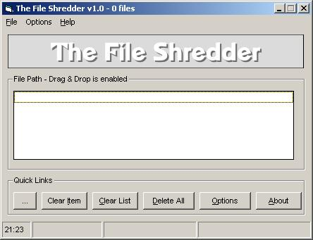



## The File Shredder 1\.0

### Description

TFS 1.0 will take any number of files - via a drag and drop interface - and overwrite them with random characters how ever many times you like (up to 1000 million). Then it will corrupt the file using random hex values before rewriting it with "". Finally, the file is deleted. I think it is quite secure; please could you let me know what you think via feedback?
 
### More Info
 

             |
---                |---
**Submitted On**   |2002-08-13 21:19:50
**By**             |[boltfishy](https://github.com/Planet-Source-Code/PSCIndex/blob/master/ByAuthor/boltfishy.md)
**Level**          |Intermediate
**User Rating**    |4.5 (18 globes from 4 users)
**Compatibility**  |VB 6\.0
**Category**       |[Files/ File Controls/ Input/ Output](https://github.com/Planet-Source-Code/PSCIndex/blob/master/ByCategory/files-file-controls-input-output__1-3.md)
**World**          |[Visual Basic](https://github.com/Planet-Source-Code/PSCIndex/blob/master/ByWorld/visual-basic.md)
**Archive File**   |[The\_File\_S1177218132002\.zip](https://github.com/Planet-Source-Code/boltfishy-the-file-shredder-1-0__1-37925/archive/master.zip)

